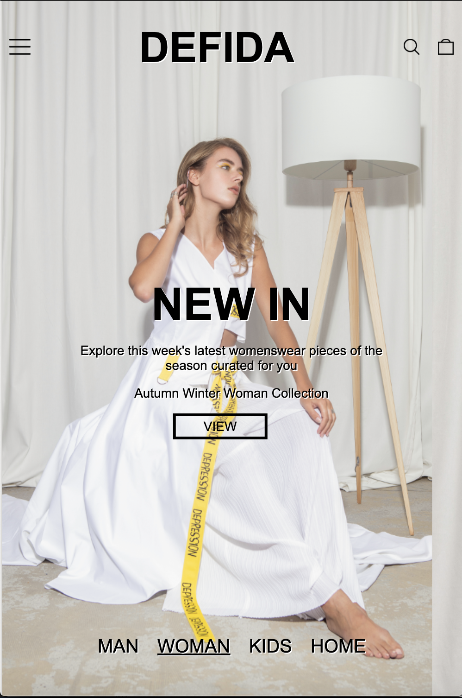
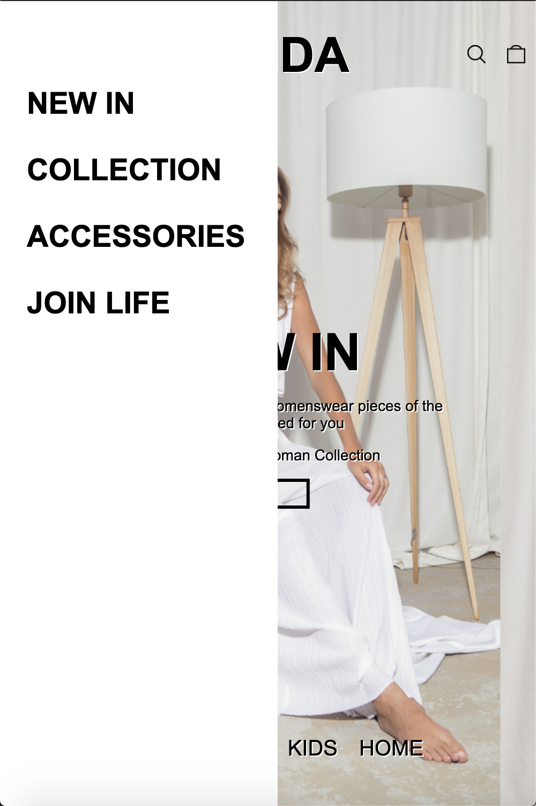
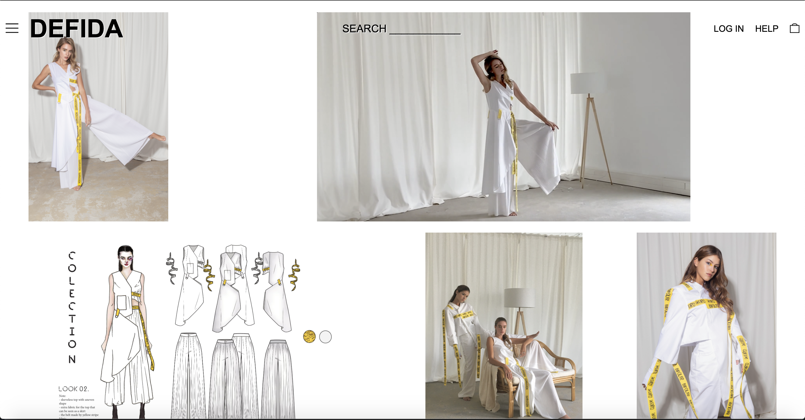
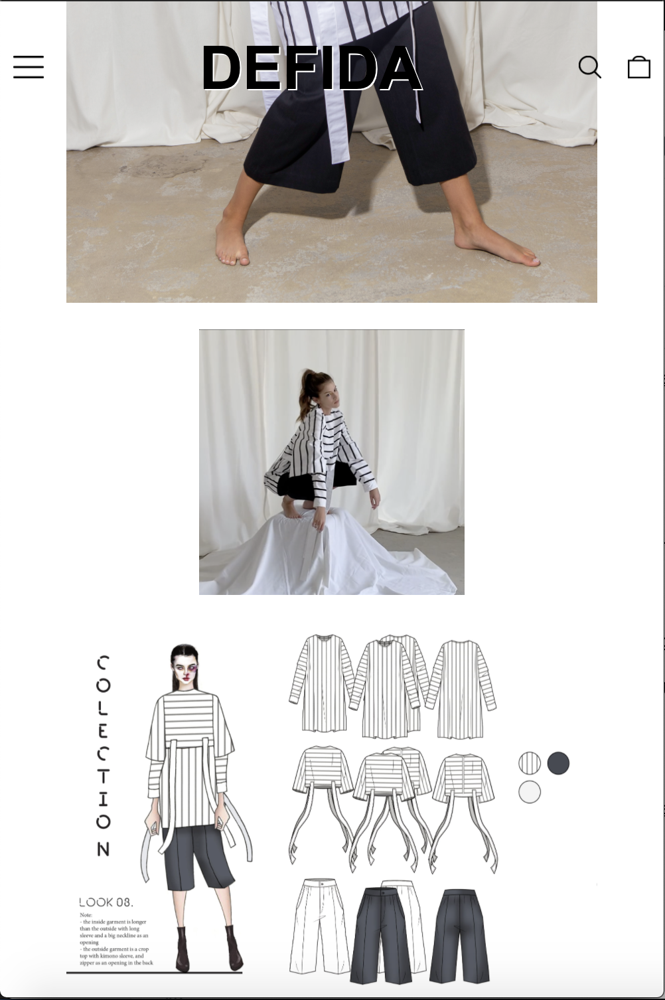
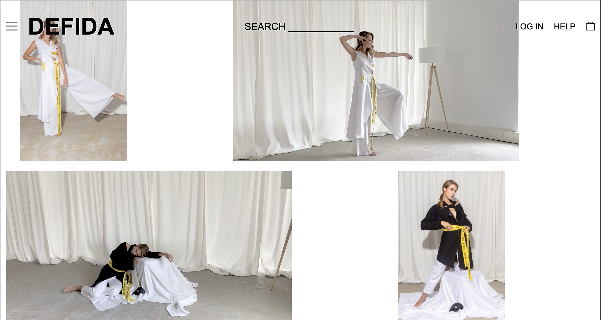
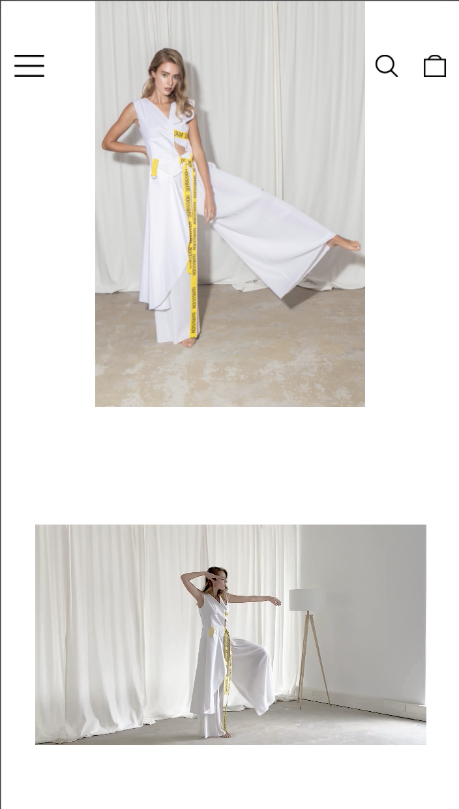
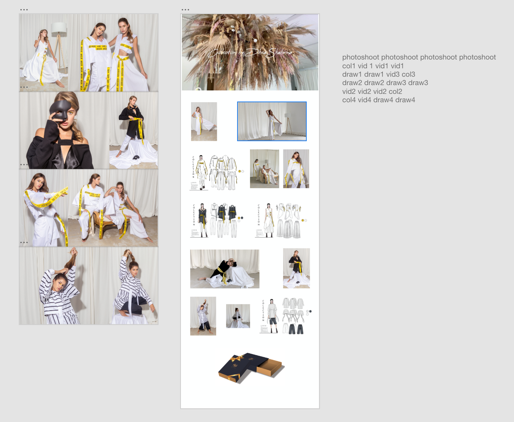

# Procesverslag
**Auteur:** Fira

Markdown cheat cheet: [Hulp bij het schrijven van Markdown](https://github.com/adam-p/markdown-here/wiki/Markdown-Cheatsheet). Nb. de standaardstructuur en de spartaanse opmaak zijn helemaal prima. Het gaat om de inhoud van je procesverslag. Besteedt de tijd voor pracht en praal aan je website.

## Bronnenlijst
1. -bron 1-
2. -bron 2-
3. -...-

## Eindgesprek (week 7/8)

I'm happy that i got to style and make the site just the way i wanted to be as well as it being responsive. 
Also the fact that all the problem that i met on the way are solved. Except with grid. I use an alternative for that. 
But for the rest i'm very happy with how it turns out.
I do want to learn more about javascript and to exercise more so then i get to know the logic better.

**Screenshot(s):**

 
 
 
 
 
 
 
 
 
 

## Voortgang 3 (week 6)

 ### Stand van zaken
I've made my second page, with grid but using another way than how it shows on dlo. I use template as i find it easier to understand. 

Media queries still a mistery. Didn't quite get how to adjust the code to my site even when i understand how it works on the exercise.

Video tag doesn't want to show up when its being opened on mobile smartphone.

There is a red notiffication on console (that element doesn't exist) but still didn't know how to fix it. It only shows on index.html as video tag only exist on collection page. 

Using XD to see how i want to do the template for my second page.

 **Screenshot(s):**

 
 
 
 

 ### Agenda voor meeting
 I couldn't attend cause of a personal reason

 ### Verslag van meeting

 -none-

 ## Voortgang 2 (week 5)

 ### Stand van zaken

 Found a way to use page snap, working on hamburger menu and trying to figure out how media query works.

 On the first screenshot you can see that it works perfectly as picture got repeated when screen gets bigger. but once the width of the screen is smaller than the image, it left a white/blank space in between (that it doesn't fill or adjust with the screen)

 Page snap does work, but its very sensitive. Once you move or slide it too much or too fast then it can skip a section

 Have been looking at how hamburger menu works but still pretty confused? I do know that it requires javascript but a way to show it only when needed is still rather hard to understand.

 **Screenshot(s):**
 -same as voortgang 1-

 
 

 ### Agenda voor meeting

 Everyone is showing their website;
 - Anoek
 - Bas
 - Fira

 ### Verslag van meeting

 Start to make the second page of the website!!!

## Voortgang 1 (week 3)

### Stand van zaken

Styling and positioning took the most time but it ended up well. Still going to work on the menu navigation. The last picture shows how it looks on desktop. Didn't upload it as its still an early progress. 

**Screenshot(s):**

### Agenda voor meeting

Vragenlijst:
- responsive maken
- video
- page snap
- algemene info (wat wordt er verwacht met de pagina's)

### Verslag van meeting

Ask student-assistent about how scroll snap works. Work on making it responsive. 

## Intake (week 1)

**Je startniveau:** rood

**Je focus:** surface plane

**Je opdracht:** https://www.zara.com/nl/en/

**Screenshot(s):**

**Breakdown-schets(en):**

