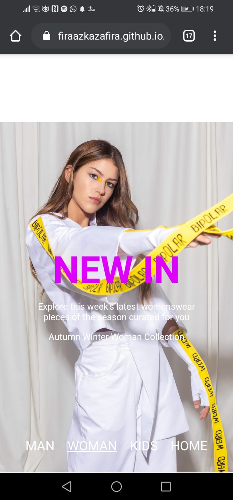
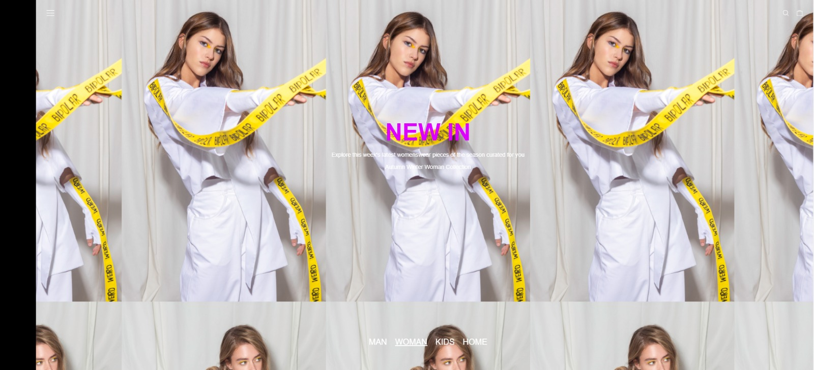
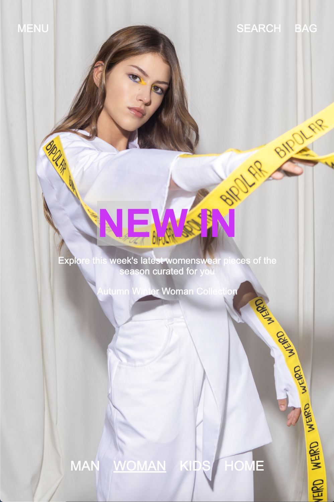
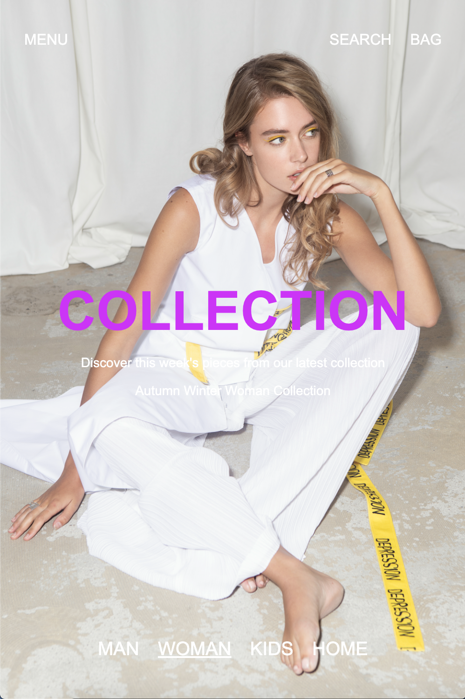
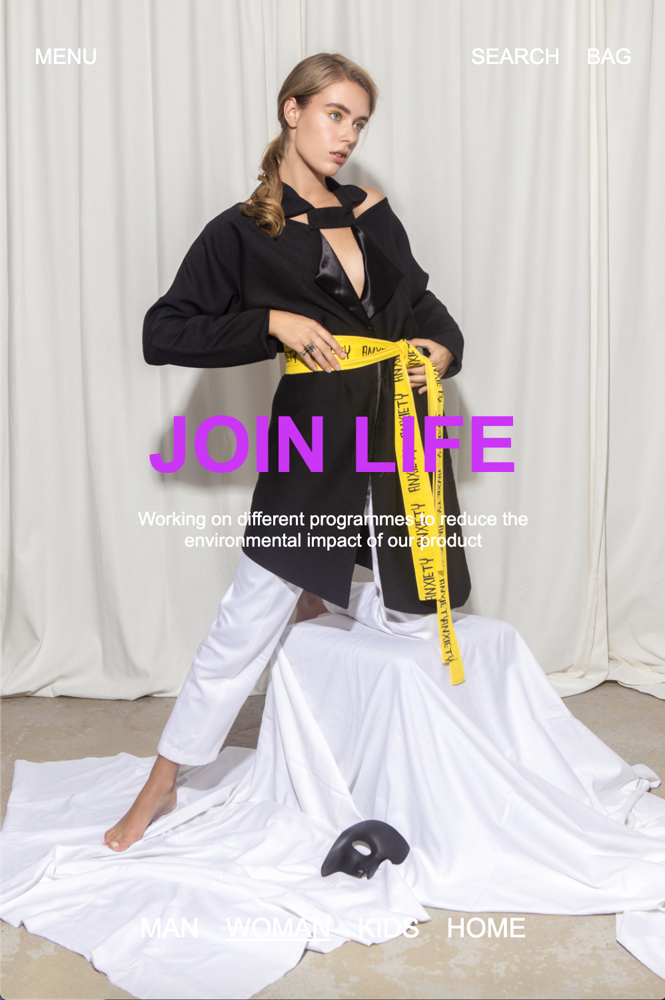
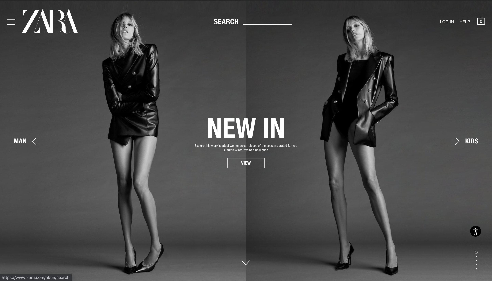
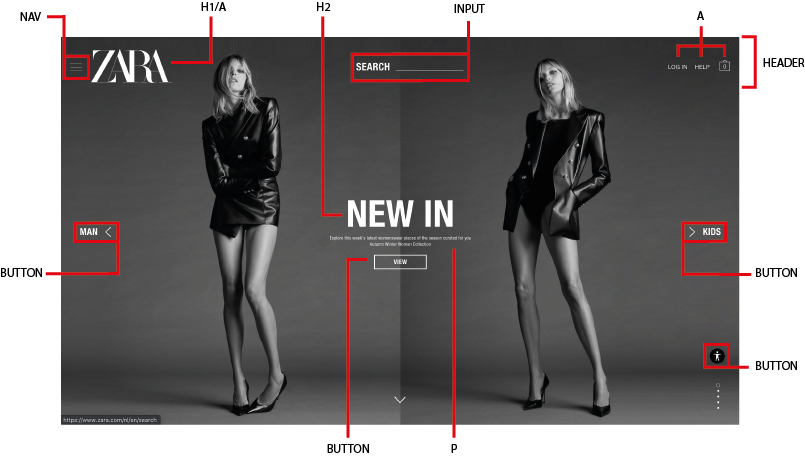

# Procesverslag
**Auteur:** Fira

Markdown cheat cheet: [Hulp bij het schrijven van Markdown](https://github.com/adam-p/markdown-here/wiki/Markdown-Cheatsheet). Nb. de standaardstructuur en de spartaanse opmaak zijn helemaal prima. Het gaat om de inhoud van je procesverslag. Besteedt de tijd voor pracht en praal aan je website.

## Bronnenlijst
1. -bron 1-
2. -bron 2-
3. -...-

## Eindgesprek (week 7/8)

-dit ging goed & dit was lastig-

**Screenshot(s):**

-screenshot(s) van je eindresultaat-

## Voortgang 3 (week 6)

### Stand van zaken

**Screenshot(s):**

### Agenda voor meeting
I couldn't attend cause of a personal reason

### Verslag van meeting

## Voortgang 2 (week 5)

### Stand van zaken

Found a way to use page snap, working on hamburger menu and trying to figure out how media query works.

**Screenshot(s):**

### Agenda voor meeting

Everyone is showing their website;
- Anoek
- Bas
- Fira

### Verslag van meeting

Start to make the second page of the website!!!

## Voortgang 1 (week 3)

### Stand van zaken

Styling and positioning took the most time but it ended up well. Still going to work on the menu navigation. The last picture shows how it looks on desktop. Didn't upload it as its still an early progress. 

**Screenshot(s):**

### Agenda voor meeting

Vragenlijst:
- responsive maken
- video
- page snap
- algemene info (wat wordt er verwacht met de pagina's)

### Verslag van meeting

Ask student-assistent about how scroll snap works. Work on making it responsive. 

## Intake (week 1)

**Je startniveau:** rood

**Je focus:** surface plane

**Je opdracht:** https://www.zara.com/nl/en/

**Screenshot(s):**

**Breakdown-schets(en):**

